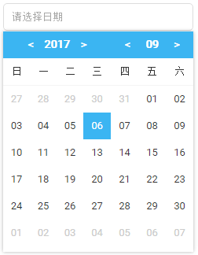

## 基于Vue的日期选择组件

### 截图

### 参数

|参数	  | 说明  | 类型	 | 可选值	| 默认值 |
|:----:|:-----:|:--------:|:-----:|:-----:|
|default-value|可选，默认显示的时间|String|可被new Date()解析|-|
|width|组件宽度|String|-|242px|
|format|输出日期格式|String|'yyyy-MM-dd, yyyy.MM.dd, yyyy/MM/dd'|yyyy-MM-dd|

### 事件
|事件名	  | 说明  | 回调参数 |
|:----:|:-----:|:--------:|
|change|当input的值改变时触发，返回值和文本框一致|格式化后的值，如: "2017-08-21"
